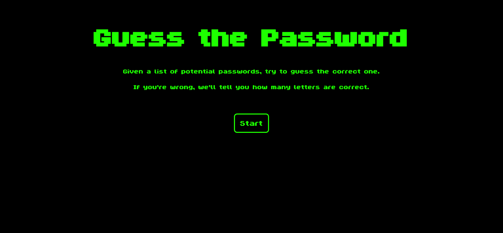
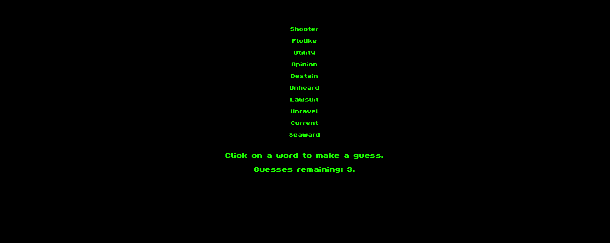
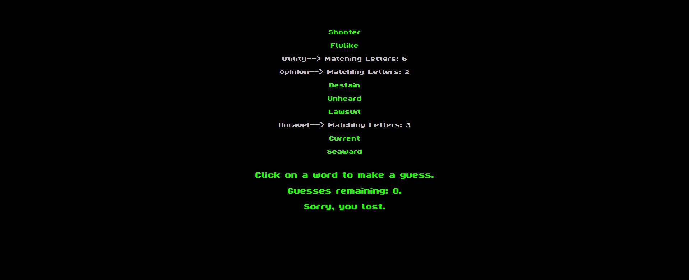

<h1 align="center">Guess The Password</h1>
<h3 align="center">Logic-Based Deduction & Pattern Recognition Game</h3>

<p align="center">
  A high-tempo, deductive reasoning game designed to challenge intuition. <strong>Guess The Password</strong> forces users to apply process-of-elimination logic to identify a hidden target string among seven randomized candidates. The architecture focuses on real-time state management and high-pressure game loop execution.
</p>

<p align="center">
  <a href="https://guess-the-password-app.netlify.app/">
    
  </a>
  <a href="https://opensource.org/licenses/MIT">
    
  </a>
</p>

---

### ✨ Core Features

* **Heuristic Deduction Engine:** Implements a logical challenge model where users refine their guesses through iterative data filtering and pattern recognition.
* **Stochastic Round Generation:** Backend-independent algorithmic generation that selects randomized target strings and decoy candidates per session to prevent pattern stagnation.
* **Game State & Constraint Management:** Strictly enforces attempt-based mechanics to sustain competitive intensity, tracking win/loss metrics and residual attempt counters in the browser's memory.
* **Adaptive Viewport & UI/UX:** Fully responsive architecture using Bootstrap 5, providing consistent input precision across high-resolution desktop and touch-enabled mobile interfaces.

---

### 🛠️ Tech Stack

**Client-Side Logic & Control Flow**
<p align="left">
  
  
</p>

**Presentation & Responsive Design**
<p align="left">
  
  
</p>

**Architecture Patterns & Algorithmic Subsystems**
<p align="left">
  
  
</p>

---

### 📸 Application Showcase

<p align="center">
  
  
</p>
<p align="center">
  
</p>

---

### 🚀 Getting Started (Local Development)

**1. Clone the repository:**
```bash
git clone https://github.com/filipposobrijanu/Guess-The-Password-App.git
cd Guess-The-Password-App
```

**2. Local Development Workflow:**
* This application is a static, client-side browser game. 
* To initialize the project locally, open the `index.html` file in your preferred web browser, or launch an environment extension like **Live Server** in VS Code to enable real-time DOM updates and hot-reloading during your testing sessions.
